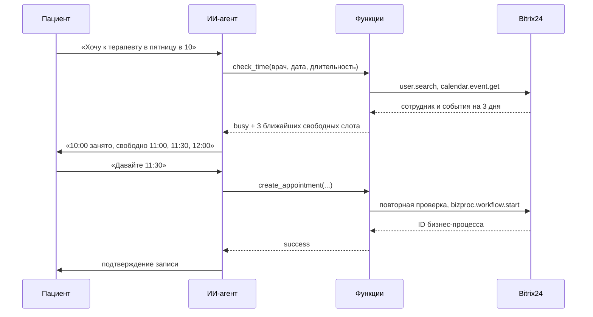

# Запись к врачу через календари Bitrix24 для ИИ-агента

Две функции для LLM-агента клиники: `check_time` проверяет, свободен ли врач в нужное время, и предлагает ближайшие варианты, `create_appointment` записывает пациента через бизнес-процесс Bitrix24.

Код обезличен и переписан для публикации из рабочих функций агента многопрофильной клиники. Вебхук, ID шаблона бизнес-процесса, имена врачей и данные пациентов заменены.

## Результат в рабочем проекте

За шесть дней наблюдения агент вёл в среднем 110 диалогов в день и создал 186 записей к врачам. Посчитано по выгрузке диалогов: запись засчитывается, когда функция записи вернула успех, отмены не вычтены.

## Как это работает



## Что пришлось решить

**Часовые пояса.** Портал, ключ вебхука, врач и пациент могут жить в разных поясах. События, созданные из другого пояса, приходили из API со сдвигом, и агент видел занятое время свободным. Каждое событие приводится к поясу клиники по полю `TZ_FROM`.

**Сетка приёма.** Слоты выравниваются по длительности услуги от начала суток. После занятого интервала поиск прыгает за его конец и снова выравнивается: 20-минутная услуга после события до 08:50 начинается в 09:00, а не в 08:50.

**Гонка за слот.** Между проверкой и согласием пациента время может занять администратор. `create_appointment` проверяет слот ещё раз прямо перед записью.

**Галлюцинации о записи.** Ответ функции адресован модели: статус и инструкция. При любой ошибке API агент получает «Запись не создана. Не подтверждай время клиенту» и передаёт диалог администратору. В статусе `busy` агенту запрещено называть время, которого нет в списке.

**Ограничения платформы.** Функции агента исполняются в песочнице NextBot: один файл, без `import`, без распаковки кортежей, без `strptime` и `strftime`, без функций с `_` в начале имени, без `zoneinfo`. Поэтому:

- логика лежит обычным пакетом в `booking/` и покрыта тестами;
- `scripts/build_nextbot.py` склеивает пакет с точкой входа, вырезает `import` и проверяет итоговый файл на запрещённые конструкции;
- смещения поясов заданы таблицей: для поясов без летнего времени этого достаточно.

## Структура

```
booking/
  slots.py        разбор дат, пояса, сетка, поиск свободных слотов
  bitrix.py       вызовы REST API: сотрудник, события календаря, бизнес-процесс
  service.py      функции агента check_time и create_appointment
nextbot/          точки входа для платформы
scripts/build_nextbot.py   сборка однофайловых функций и проверка ограничений
dist/             собранные функции для вставки в NextBot
tests/            тесты логики и сценариев на подменённом API
```

## Запуск

```bash
pip install -r requirements-dev.txt
pytest
python scripts/build_nextbot.py
```

Для работы с порталом нужен входящий вебхук с правами на пользователей, календарь и бизнес-процессы, а также шаблон бизнес-процесса, который создаёт событие в календаре врача. Адрес вебхука и ID шаблона задаются в `CONFIG` точек входа.

## Ограничения

- Таблица поясов не учитывает переход на летнее время.
- Эта версия проверена тестами локально; в песочнице NextBot работали исходные функции, из которых она собрана.
