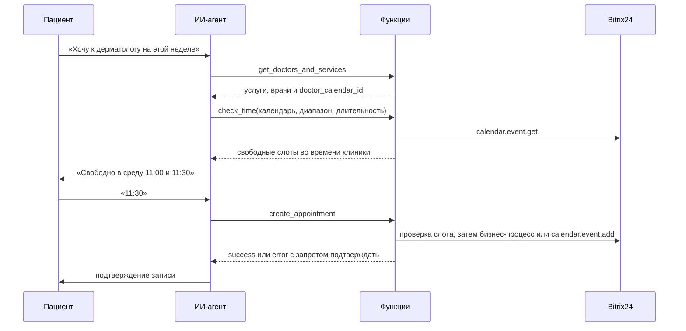

# Запись к врачу через календари Bitrix24 для ИИ-агента

Функции LLM-агента клиники: `check_time` ищет свободное время врача в заданном диапазоне, `create_appointment` записывает пациента. Первая запись по лиду идёт бизнес-процессом Bitrix24, повторные — событием прямо в календаре врача.

Код обезличен и собран для публикации из рабочих функций агента многопрофильной клиники на платформе NextBot. Вебхук, ID шаблона, поля CRM, имена врачей и данные пациентов заменены.

## Результат в рабочем проекте

За шесть дней наблюдения агент вёл в среднем 110 диалогов в день и создал 186 записей к врачам. Посчитано по выгрузке диалогов: запись засчитывается, когда функция записи вернула успех, отмены не вычтены.

## Как это работает



## Что пришлось решить

**Какой календарь открыть.** Сначала врач искался по ФИО через `user.search` и ошибался: к ФИО в профилях дописана специальность, встречаются буквы национальных алфавитов и тёзки. Теперь в CRM есть справочник «Услуги и врачи», где у каждой услуги указаны врачи и ID их календарей. Агент получает `doctor_calendar_id` из справочника, а функция сверяет его с ФИО. ФИО сравниваются с учётом падежа: «к Ивановой Анне» находит «Иванова Анна Сергеевна». При неоднозначности функция возвращает агенту ошибку с подсказкой, а не угадывает.

**Часовые пояса.** Это главная сложность проекта:

- `calendar.event.get` отдаёт `DATE_FROM` в поясе самого события, а не читателя. События, созданные из разных поясов, нельзя сравнивать как строки;
- поле `DATE_FROM_TS_UTC` на портале расходилось с `DATE_FROM` на несколько часов, ему не доверяем;
- у врачей одного портала разные пояса, а у части сотрудников пояс не задан вовсе.

Поэтому каждое событие переводится в эталонный пояс клиники по своему `TZ_FROM`. В этом поясе агент ищет слоты и называет время пациенту.

**Случай из эксплуатации.** В начале сентября 2026 повторные записи стали садиться на два часа позже названного пациенту времени и наезжать на чужие приёмы. Код при этом не менялся. Разбор данных портала показал чёткий разрез: 135 повторных записей в поясе клиники, затем 29 подряд в поясе владельца вебхука. Оказалось, что `calendar.event.add` перестал принимать ключи `tzFrom` и `tzTo` и молча их игнорировал. Исправление — ключи `timezone_from` и `timezone_to`. Пострадавшие записи выгружены списком для регистратуры. Тест `test_additional_booking_writes_event_with_timezone_keys` не даст вернуть старые ключи.

**Гонка за слот.** Между проверкой и согласием пациента время может занять администратор. Функция записи проверяет слот повторно прямо перед созданием события.

**Модель не подтверждает несуществующую запись.** Ответ функции содержит статус и инструкцию для модели. При любой ошибке Bitrix24 агент получает «Запись не создана. Не подтверждай время пациенту» и тег `booking_error`, по которому диалог видит администратор.

**Проверки на живом портале без риска.** `tests/readonly_guard.py` перехватывает HTTP-запросы. Чтение уходит на портал. Запись, включая пишущие команды внутри `batch`, не отправляется: код получает фиктивный ответ, а в журнале видно, что он записал бы. Так новую версию можно сверить с работающей на реальных календарях.

## Отличие от работающей версии

В рабочих функциях переводы между поясом клиники и поясом владельца вебхука пока сделаны постоянными сдвигами в часах. Они верны, пока у владельца вебхука не поменяли пояс в профиле. В этой версии сдвиги заменены переводом через `zoneinfo`: это следующий запланированный шаг для рабочего проекта.

## Платформа

Функция NextBot загружается одним файлом и возвращает результат в переменной `result` со структурированным контрактом (`tool_result`, `tags`, `variables`). Поэтому логика лежит пакетом в `booking/` и покрыта тестами, а `scripts/build_nextbot.py` склеивает пакет с точкой входа в однофайловую функцию в `dist/`. Тест проверяет, что собранный файл исполняется сам по себе.

## Структура

```
booking/timezones.py   разбор дат Bitrix24 и перевод в пояс клиники
booking/slots.py       свободные слоты по сетке длительности в диапазоне дней
booking/doctors.py     справочник врачей, сравнение ФИО с учётом падежа
booking/bitrix.py      REST API: справочник, события, лид, запись событием и бизнес-процессом
booking/service.py     функции агента check_time и create_appointment
nextbot/               точки входа для платформы
scripts/build_nextbot.py   сборка однофайловых функций
dist/                  собранные функции
tests/                 сценарии на подменённом портале, защита от записи
```

Функция каталога `get_doctors_and_services`, которая отдаёт агенту услуги и календари врачей, в репозиторий не входит.

## Запуск

```bash
pip install -r requirements-dev.txt
pytest
python scripts/build_nextbot.py
```

Для портала нужен входящий вебхук с правами на CRM, календарь и бизнес-процессы, шаблон бизнес-процесса записи и справочник услуг и врачей. Настройки задаются в `CONFIG` точек входа.
